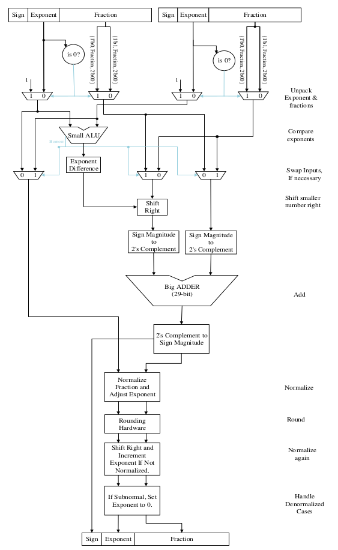

# Floating-point adder implementation on FPGA

## Introduction
This repository contains floating-point adder/subtractor verilog implementation based on IEEE-754 standard (you can check out the standard from [here](https://standards.ieee.org/standard/754-2019.html "IEEE-754 standard")). In most CPUs, floating point arithmethic is done by fixed-point numbers. But, this approach is quite time-consuming and takes too many CPU cycles to be computed. However, in daily usages, it is not that important since we don't do lots of computations. But, for applications that need too much computation, it is better to implement floating-point addition on hardware. 

## Codes
The implementation is in `fp_adder.v` file and mutiple testbenches are written to test the hardware accuracy. The testbench files are in verilog and system verilog format. Plus, a `.hex` file has saved some test values to measure the hardware accuracy. 

The implementation is based on this diagram:

 

Code has been written with respect to the block diagram shown above
